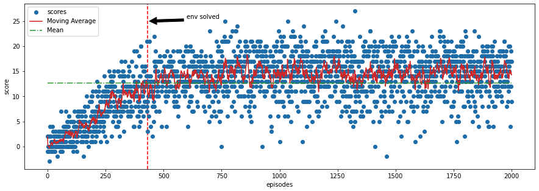

# Banana's Collector

Unity Machine Learning Agents (ML-Agents) is an open-source Unity plugin that enables games and simulations to serve as environments for training intelligent agents.

For game developers, these trained agents can be used for multiple purposes, including controlling NPC behavior (in a variety of settings such as multi-agent and adversarial), automated testing of game builds and evaluating different game design decisions pre-release.

## The Environment

For this project, the agent was trained to navigate (and collect bananas!) in a large, square world.


A reward of +1 is provided for collecting a yellow banana, and a reward of -1 is provided for collecting a blue banana. Thus, the goal of your agent is to collect as many yellow bananas as possible while avoiding blue bananas.

The state space has 37 dimensions and contains the agent's velocity, along with ray-based perception of objects around the agent's forward direction. Given this information, the agent has to learn how to best select actions. Four discrete actions are available, corresponding to:

- 0 - move forward.
- 1 - move backward.
- 2 - turn left.
- 3 - turn right.

The task is episodic, and in order to solve the environment, your agent must get an average score of +13 over 100 consecutive episodes.

## Installation

Use the [docker](https://www.docker.com) to test the algorithm.

```bash
docker pull fernandofsilva/banana_collector 
```


## Usage

Run with default parameters

```bash
docker run fernandofsilva/banana_collector 
```

Run with custom parameters

```bash
docker run fernandofsilva/banana_collector  --n_episodes 2000 --max_t 1000 --eps_start 1.0 --eps_end 0.01 --eps_decay 0.995 --buffer_size 100000 --batch_size 64 --gamma 0.99 --tau 0.001 --lr 0.0005 --update_every 4 
```

Each parameter correspond to:

- n_episodes: maximum number of training episodes
- max_t: maximum number of time-steps per episode
- eps_start: starting value of epsilon, for epsilon-greedy action selection
- eps_end: minimum value of epsilon
- eps_decay: multiplicative factor (per episode) for decreasing epsilon
- buffer_size: replay buffer size
- batch_size: mini-batch size
- gamma: discount rate
- tau: a soft update of target parameters
- lr: learning rate
- update_ever: how often to update the network


## Output

Expected final output

```
Episode 2000    Average Score: -0.10
```


## Scores

Below, there are the scores during training of the neural network




## Contributing
Pull requests are welcome. For major changes, please open an issue first to discuss what you would like to change.


## License
[MIT](https://choosealicense.com/licenses/mit/)