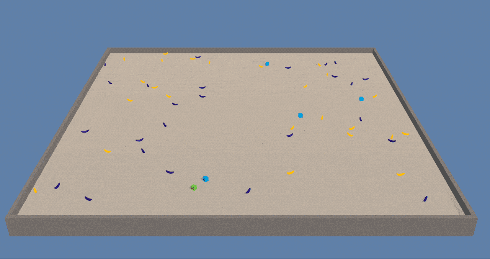
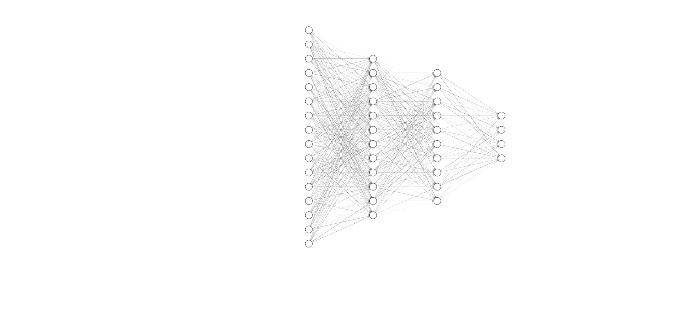

# Banana Collector using a Deep Q-Learning

## Introduction

In Banana Collectors, an agent move around an area attempting to collect as many rewarding bananas (yellow) as possible, while avoiding negatively rewarding bananas (purple). The catch is that the agents can fire lasers at one another, freezing them in place. Inspired by [research from DeepMind](https://deepmind.com/blog/article/understanding-agent-cooperation), the agent can learn to either fight over the bananas, or peacefully share them, depending on the number of rewarding bananas within the scene.

## Learning algorithm
For the task, it was used the double deep Q-learning algorithm using fixed Q-target and experience replay was used. 
The algorithm use epsilon greedy exploration.

### Parameters table

Below the table with the parameters used by the agent

| Parameter     | Value     | 
| ------------- |:---------:| 
| n_episodes    | 2000      |
| max_t         | 1000      |
| eps_start     | 1.0       |
| eps_end       | 0.01      |
| eps_decay     | 0.995     |
| buffer_size   | int(1e5)  |
| batch_size    | 64        |
| gamma         | 0.99      |
| tau           | 1e-3      |
| lr            | 5e-4      |
| update_every  |4          |

### Neural network

It was used a neural network with 3 hidden layers with 256, 128 and 32 nodes each one, all hidden layers used ReLu as activation function.
The output layer has 4 nodes (according the action space 0, 1, 2 and 3) with linear ouput (without action function)

## Results

The results show the reward per episode, the dots represent the reward per episode, the straight red line represents the reward moving average with the windows of 10 rewards, the dashed red line shows when the environment was solved (when the mean of the last 100 rewards are above 13) and the dashed green line shows the mean of all rewards.

## Future work

In future work, it would be an options to implement prioritized experience replay and others kinds of Q-learning (dueling or even Rainbow). It would also be interesting to learn directly from pixels and use convolutional layers in the deep Q-network.
